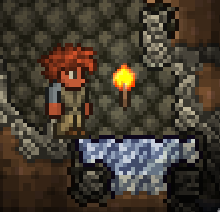

## Table of contents
* [Global Informations](#global-informations)
* [Technologies](#technologies)
* [Setup](#setup)
* [Some Pictures](#some-pictures)

## Global informations
This project is my first project in C#.  
It allows me to discover how work C# and the TModloader Lib.

For this one I chose to do a mod that will allow you to play Terraria with a new PvP system.

Be indulgent : I'm a student so i can't give so much time for this project and I'm not really familiar with C#

[](https://wakatime.com/badge/user/8fc98ba4-4c20-4295-aa16-edcf9fcb84c5

## Technologies
Project is created with:
* Tmodloader version: v2022.9.47.13
* Run on terraria version: v1.4.3.6
* Make with C#

## Setup
This project is not yet available, but i just try to do a good Readme.

```
$ cd test_to_show_code
```

## Some pictures

Simple ore :  


Rare ore (spawn in toundra biome) :  
